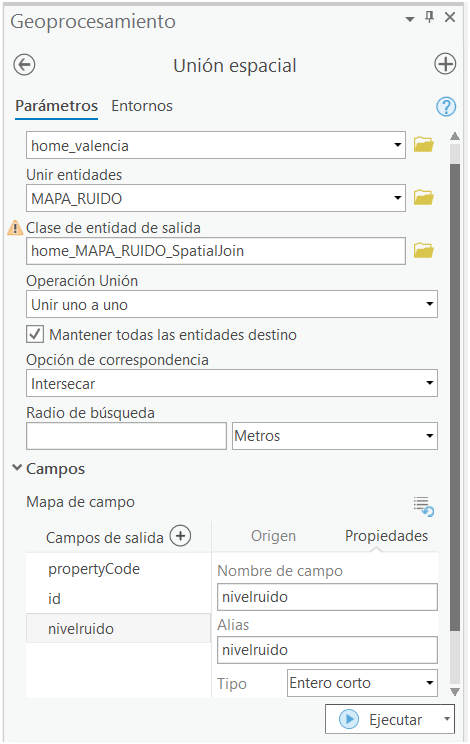
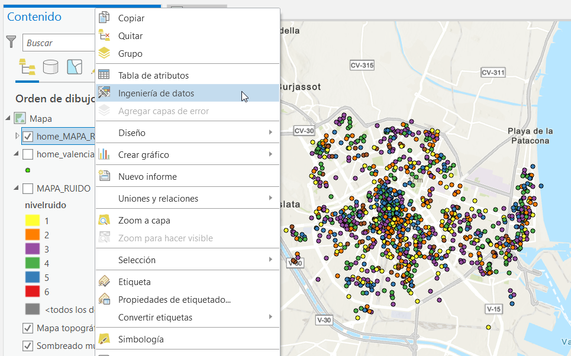
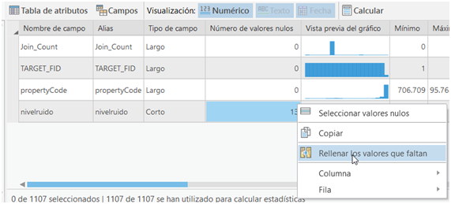
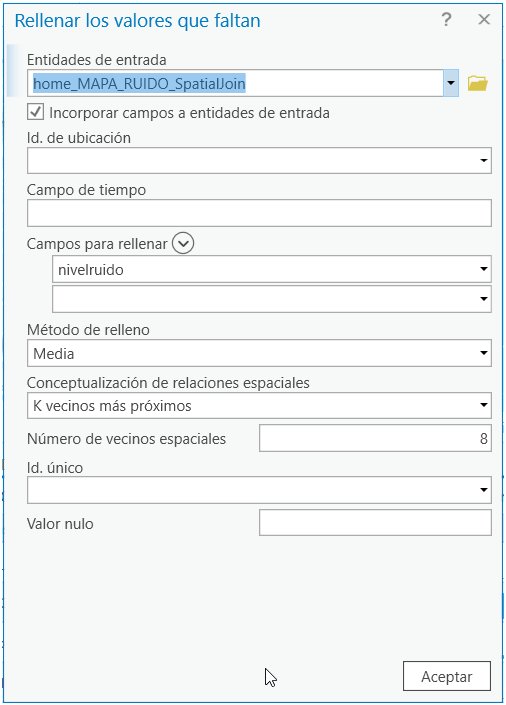
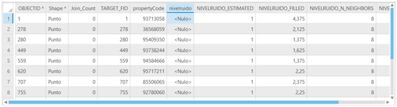
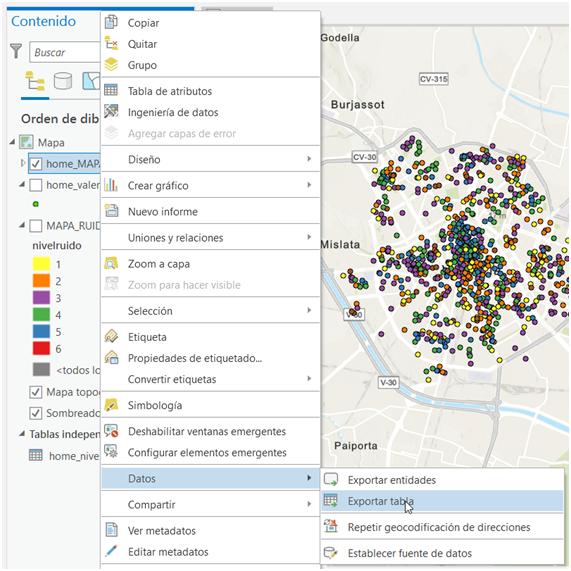
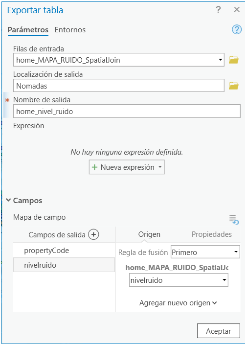

- **home_valencia_nivel_ruido.csv**: CSV con el id de propiedad y el nivel de ruido obtenido del enlace https://www.valencia.es/dadesobertes/es/dataset/?id=mapa-soroll-lden-24-h

  Se ha realizado usando la aplicación [ArcGIS Pro](https://www.esri.com/es-es/arcgis/products/arcgis-pro/overview). Se ha hecho una [Join Espacial](https://pro.arcgis.com/es/pro-app/latest/tool-reference/analysis/spatial-join.htm) entre el csv **home_valencia.csv** y la capa de niveles de ruido descarga de https://www.valencia.es/dadesobertes/es/dataset/?id=mapa-soroll-lden-24-h.

  Capturas de pantalla con los pasos:
  1. Join Spacial
     

  2. Feature Engineering
    

  3. Rellenar NaNs
    

    

    

  4. Exportar datos a CSV
    

    
